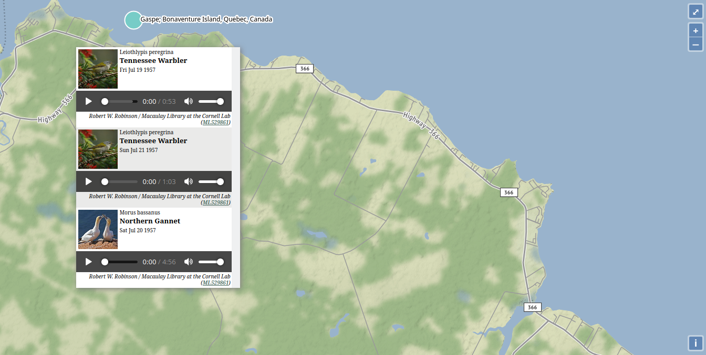

# Audiomnia
> A global bioacoustics map

[](https://github.com/RichardLitt/standard-readme)

Data provided by the
[The Macaulay Library at the Cornell Lab of Ornithology](https://macaulaylibrary.org/)
and iNaturalist.

## Table of Contents

- [Usage](#usage)
    - [Local one-liner](#local-one-liner)
- [Contributing](#contributing)
    - [Installing](#install)
    - [Scrapers](#scrapers)
- [License](#license)

## Usage

### https://audiomnia.com



The main interface is a simple visualization of the bioacoustic samples
in the database. Drill down geographically by clicking. When the
zoom level reaches maximum a listing of samples will be displayed.

### Local One-liner

To run the application locally, you can simply run:

```bash
$ npx audiomnia # or run a specific version i.e. npx audiomnia@0.1.1
```

This requires node.js, which can be installed easily using [`nvm`](https://nvm.sh).

## Contributing

Happy to consider issues and PRs are highly encouraged. Experience
with [OpenLayers](https://openlayers.org/), [Scrapy](https://scrapy.org),
and front-end web development is welcome, but more importantly
bioacoustics, conservation, ornithology, and marine science expertise
is needed, perhaps even moreso.

### Setting up for development

First, grab the source code and install the dependencies:

```
$ git clone https://github.com/audiomnia/audiomnia
cd audiomnia
npm install
```

Then, `npm start` will run the app for you and should work
"out of the box."

### Scrapers

Audiomnia uses [Scrapy](https://scrapy.org) for its scrapers.

Currently, the data sets are small enough to check into the repo,
so checking out the source code will also include the geojson
files. However, if you're working on the scrapers.

```
npm run scrape
```

This is shorthand for:

```bash
cd scrapers
scrapy crawl macaulaylibrary -a MAX=50000 --loglevel WARNING
```

You can read the Scrapy docs to learn more about the [`scrapy crawl`](https://docs.scrapy.org/en/latest/topics/commands.html#crawl)

#### Scrapy cache

By default, HTTP Caching is enabled in the Scrapy config. This will deposit a LOT
of data in ./scrapers/scrapers/.scrapy. This will make your development much easier
and your scraping much more polite.

## License

[GPL-3.0](./LICENSE.md) © 2020 Audiomnia
